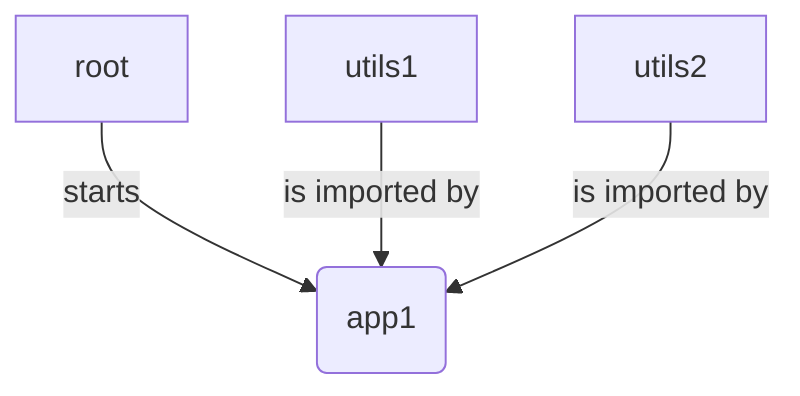

# Introduction

This repo is a sample to bootstrap a running single-spa project using typescript, yarn workspace and vscode.

It will be helpfull for anybody annoyed by typescript that is not working as we all think it should, I mean without effort ;)

Currently you can run the app (see bellow) and live modify a package by adding/editing/removing a function/component in utils (see below) and use it from app1 (see bellow). Of course, VScode is also working fine and do not raise any typescript errors and perform auto-completion.

To extend this idea, all packages that want to use another pacakge shall be declared in its tsconfig.json / references.
In addition its fork-ts-checker-webpack-plugin configuration shall change to set build parameter to true : 
```
      new ForkTsCheckerWebpackPlugin({
        typescript: {
          mode: "readonly", // Assuming that your production build use tsc
          build: true, // This enables your app to build also dependencies (references), otherwise you will have typescript errors because your project won't be aware of your reference project
        },
      }),
```     

# Work in progress
Faster reloads using [react fast-refresh](https://github.com/pmmmwh/react-refresh-webpack-plugin)
=> This seems ok on app1 when modifying app1
=> But if I trigger a modification on utils1, then all the app is reloading which I would like to avoid by reloading only utils1.

# Next steps

Automatic CSS prefix by workspace name to avoid css collision 

# Recipe

## Single-spa

This repo introduce how to build a very simple mfe(micro frontend) app using single-spa.

Each mfe is created from scratch by using create-single-spa.

We will have this mfe simple structure:



## Typescript

Each mfe will use typescript.

## Node 18.12.0 and Yarn 3.5.0

Each mfe will be located in a yarn workspace.

## VS Code

VS Code will be used as IDE

# Install

1. Move to any unix system (wsl, ubuntu, whatever) 
2. Clone this repo
3. Install Node v18.12.0 and then Yarn v3.5
4. Install vsCode
5. Open root folder in VS Code and install recommended extension(s) (mandatory)
6. Open a shell in root folder, run node -v and yarn -v to check your are pointing ot the right versions
7. Then run yarn to check all packages are (already) there
8. Then run yarn start to start all our mfe
9. Application is reachable on http://localhost:9000

# Running screenshot

