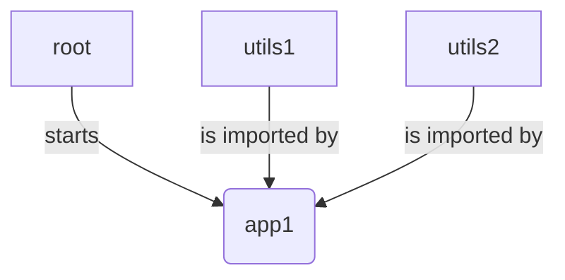

# Introduction

This repo under construction is a sample to build a single-spa project using typescript, yarn workspace and vscode.

> Why typescript is annoying us but not webpack :(

It will be helpfull for anybody annoyed by typescript that is not working as we all think it should, I mean without effort ;)

# Receipe

## Single-spa

This repo introduce how to build a very simple mfe(micro frontend) app using single-spa.

Each mfe is created from scratch by using create-single-spa.

We will have this mfe simple structure:

## Typescript

Each mfe will use typescript.

## Node 18.12.0 and Yarn 3.5.0

Each mfe will be located in a yarn workspace.

## VS Code

VS Code will be used as IDE

# Install

1. Move to any unix system (wsl, ubuntu, whatever) 
2. Clone this repo
3. Install Node v18.12.0 and then Yarn v3.5
4. Install vsCode
5. Open root folder in VS Code and install recommended extension(s) (mandatory)
6. Open a shell in root folder, run node -v and yarn -v to check your are pointing ot the right versions
7. Then run yarn to check all packages are (already) there
8. Then run yarn start to start all our mfe
9. Application is reachable on http://localhost:9000

# Running screenshot

